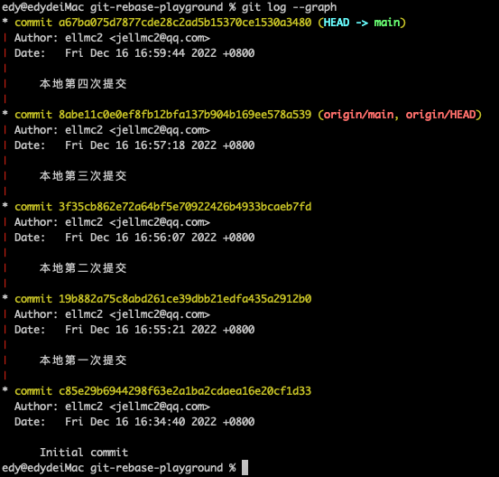

# git-rebase-playground

项目初始时commit信息状态：



```
git rebase -i HEAD~4

# 按i键进入输入模式

pick 倒数第四次提交
s 倒数第三次提交
s 次最新的提交
s 最新的提交

# esc退出，wq保存
# 按i键进入输入模式，修改commit信息
# esc退出，wq保存

(完成rebase)

# 强制推送到远程
git push -f